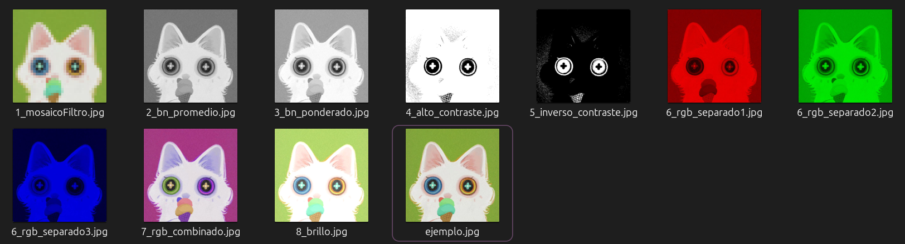
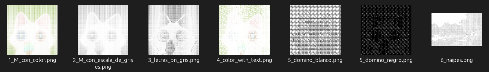
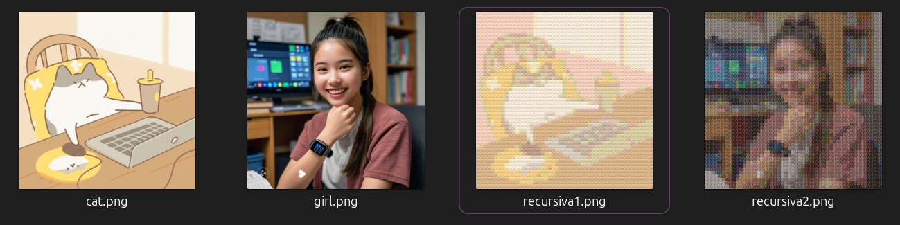
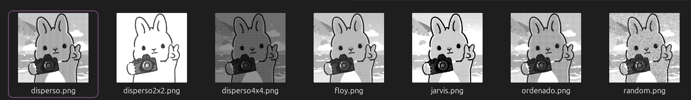
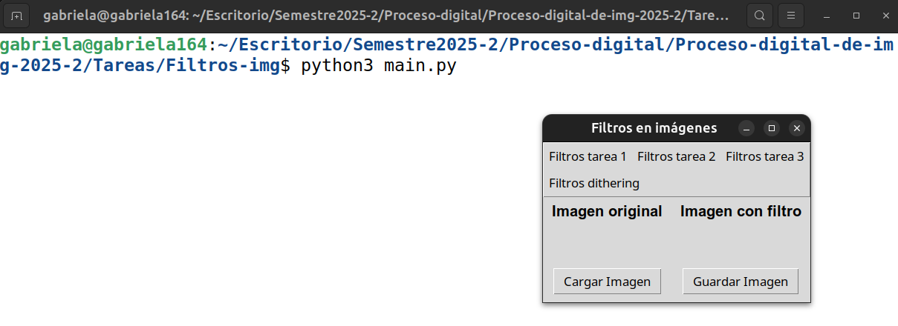
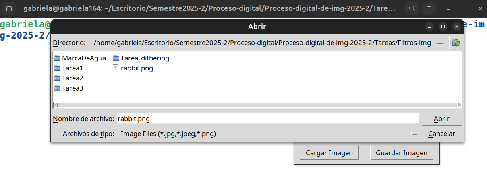
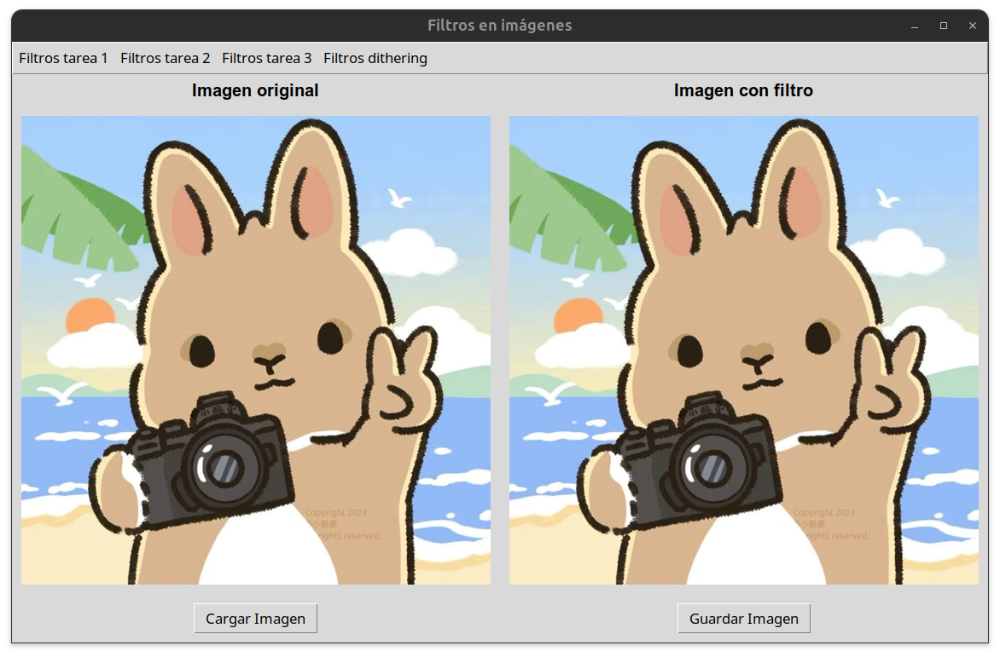
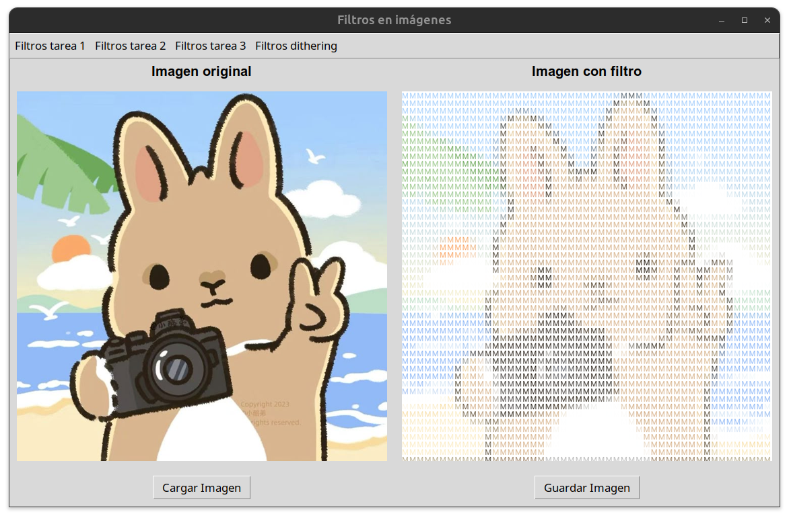

# 🖼️ 🌱 Aplicador de filtros: Proceso Digital de imágenes 2025-2


* 👨🏻‍🏫**Profesor** : Manuel Cristóbal López Michelone
* 👨🏻‍💻**Ayudante de laboratorio** : César Hernández Solís
* 👩🏻**Ayudante de teoría** : Yessica Martínez Reyes


## Alumna y No. de cuenta

* 📚 Facultad de Ciencias, UNAM. 
* 👩🏻 Gabriela López Diego 318243485
* 📆 Fecha: Mayo 2025


## **DESCRIPCIÓN** : Aplicador de varios tipos de filtros

Este proyecto es un procesador de imágenes que permite aplicar diversos filtros en tiempo real y visualizar los resultados a través de una interfaz gráfica interactiva. Además, proporciona funcionalidades avanzadas como la generación de imágenes recursivas, marcas de agua y procesamiento de imágenes con técnicas de dithering.






<br>


## 📚 Objetivo 

Aplicar conceptos de procesamiento de imágenes y recursividad para transformar imágenes mediante distintos filtros, incluyendo mosaico, escala de grises, alto contraste, dithering y más. También se busca explorar la generación de imágenes compuestas por miniaturas que mantienen la fidelidad cromática de la imagen original.


## Dependencias

Instalar las siguiente dependencias para que se ejecute de forma correcta el proyecto. 
  ``` bash 
    pip install pillow numpy matplotlib scipy
  ```
  
NOTA: En caso de usar linux, se recomienda usar un entorno virtual.

## ⭐ Estructura del trabajo

Se tiene una carpeta llamada **Tareas** que contiene ACTUALMENTE las siguientes carpetas

1. `Tarea1` : Contiene el script *Tarea1PD.py* que aplica los filtros:  mosaico, escala de grises (Promedio RGB), escala de grises (Ponderado (.30*r + .70*g + .10*b)), alto contraste, inverso contraste, RGB por separado, RGB combinado, brillo
2.  `Tarea2`: Contiene el script *Tarea2PD* y una carpeta _Fuentes_ con las fuentes: roboto, domino negro, domino blanco y cartas de tipo `.ttf`. Este script aplica los filtros sopa de letras. 
3.  `Tarea3`: Contiene el script *Tarea_img_recursivas* junto con otra carpeta _CSV_ necesario para que el script aplique el filtro de imagenes recursivas. Esta configurado para aplicar la misma imagén de relleno. 
4.  `Tarea_dithering.py`: Contiene un script  que aplica una lista de filtros dithering: azar, ordenado, disperso, disperso 2x2, disperso 4x4, Floyd steinberg y jarvis judice ninken. 
5.  `MarcaDeAgua`: Contiene un script que coloca un logo a una imagen como marca de agua y una carpeta **retoQuitarMarcas** que contiene *quitar_marcas.py* que quita las marcas de agua de color rojo de las 4 imagenes indicadas.
6. `Tarea_semitonos_dados` contiene *semitonos_dados.py* que realiza los filtros de semitonos y dados. 
7. `Tarea_oleo`: Contiene *Tarea_oleo.py* que aplica los filtros oleo color y oleo blanco y negro (acuarela). 
8. `Tarea_mosaicos_redondos_estrellas` contiene el script que genera mosaicos usando circulos o estrellas utilizando el color promedio de regiones con tamaño especificos. 
9.  `Tarea_ATT`: contiene el script que aplica el filtro que simula el logo AT&T con ayuda de franjas negras. 
10. `Tarea_ecualizacion_histograma`: contiene un .py que aplica el filtro de ecualización de histogramas. 
11. `Tareas_teoria_de_cuerdas`: contiene el .py que aplica el filtro de hilos. 

Junto a la carpeta **Tareas** se tiene 
- `img-readme`: Imagenes utilizadas dentro del readme. 
- `README.md`: readme para las instrucciones de ejecución y dependencias necesarias.  
- `main.py`: Archivo .py principal que nos ayuda a mostrar al usuario una interfaz de usuario y le permita aplicar aplicar el filtro que desee y pueda visualizarlo en tiempo real.  De igual manera, permite descargar la imagen con el filtro aplicado. 


**NOTA IMPORTANTE**: El reto de quitar marcas de agua no esta incluido dentro de la interfaz de usuario. Debemos dirigirnos al directorio:

```bah
Tareas/MarcaDeAgua/retoQuitarMarcas
```
Una vez dentro de la carpeta ejecutar el script (En linux) en windows solo es **python**

```bah
python3 quitar_marcas.py
```

Esto nos generará dentro de la carpeta **img_sin_ma** las imágenes indicadas sin la marca de agua roja que tenia anteriormente. 

## 📌 Explicación de ejecución

Ejecutar el script .py en VSC (o nuestro IDE preferido) o bien, escribir el siguiente **comando en terminal** en la ruta donde se encuentre el mismo archivo **main.py**

LINUX:

``` bash
python3 main.py
```

En WINDOWS:

``` bash
python main.py
```
Podemos utilizar la imagenes que colocamos como ejemplo para probar los distintos filtros que se encuentran dentro de la carpeta _img-para-probar_. Se recomienda usar histograma.jpg para aplicar la ecualizacion y el retrato de mosalisa para aplicar el filtro de arte de hilos para apreciar mejores resultados. 


## 📚 Ejemplo de ejecución

<p>
    
    
</p>

<p>
    
    
</p>

NOTA: Podemos probar con distintas imágenes y guardar las imagenes resultantes después de aplicar algún filtro. 

---


