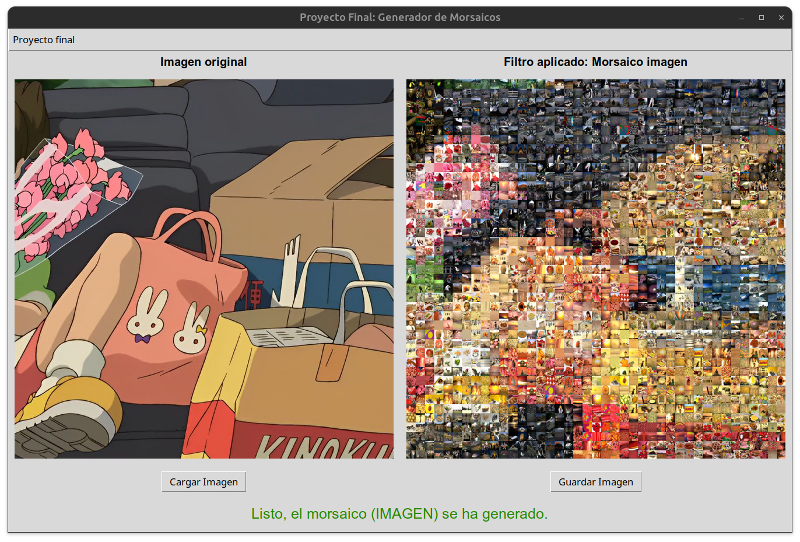

# ✨ Proyecto Final: Generador de morsaicos.

* 👩🏻 Nombre y No. de cuenta: Gabriela López Diego **318243485**
* 📆 Fecha: 25 Mayo 2025


###  ✅ Encargados de impartir el curso Proceso Digital de Imagenes 2025-2

``` bash 
👨🏻‍🏫 Profesor : Manuel Cristóbal López Michelone
👨🏻‍💻 Ayudante de laboratorio : César Hernández Solís
👩🏻 Ayudante de teoría : Yessica Martínez Reyes
```
---

### Descripción del proyecto 

**Generador de morsaicos** : Este proyecto genera un mosaico visual a partir de una imagen original utilizando una galería de otras imagenes de miniaturas. El proyecto tiene dos salidas 

- Imagen: puede visualizarse desde la interfaz.  También podemos guardar el resultado generado. 
- Tabla HTML: lo podemos visualizar desde algún navegador.

El proyecto se compone de la siguiente manera: 

1. `Carpeta imagenes`: contiene una extensa cantidad de imagenes que se tomarán como referencia para ir construyendo el morsaico de la imagen original. 
2. `Carpeta colores`: Contiene el archivo colors.txt donde se extraeran los colores principales de la galeria de imagenes. 
3. Archivo `generadorMorsaicos.py`: contiene funciones que nos permiten calcular el color promedio de las regiones que definamos de nuestra imagen, seleccionar la miniatura más parecida a cada región según el color promedio obtenido, construir el morsaico dentro de una tabla html o en formato imagen PIL, 
4. Archivo `interfazNuevo.py`: Archivo principal para construir la interfaz interativa con el usuario. Le permite al usuario mostrar la imagen resultante si se escoge la opcion de _morsaico imagen_ así como la opción de poder guardarla. Si escoge la opción _morsaico html_  podrá solo saber cuando el proceso termino y se le indicará que se guardo junto a este mismo archivo. 


## Dependencias

Instalar las siguiente dependencias para que se ejecute de forma correcta el proyecto. 
  ``` bash 
    pip install pillow 
  ```


## 📌 Explicación de ejecución

Ejecutar el script .py en VSC (o nuestro IDE preferido) o bien, escribir el siguiente **comando en terminal** en la ruta donde se encuentre el mismo archivo `Fotomorsaicos/interfazNuevo.py`

LINUX:

``` bash
python3 interfazNuevo.py
```

WINDOWS:

``` bash
python interfazNuevo.py
```

## 📚 Ejemplo de ejecución 
<div>
  <strong>INTERFAZ CUANDO EL USUARIO DA CLICK EN MORSAICO EN IMAGEN</strong><br>
  
</div>

<div>
  <strong>IMAGEN MORSAICO OBTENIDA</strong><br>
  
</div>

<div>
  <strong>INTERFAZ CUANDO EL USUARIO DA CLICK EN MORSAICO EN HTML</strong><br>
  
</div>

<div>
  <strong>TABLA HTML OBTENIDA</strong><br>
  
</div>

<div>
  
</div>


---

### ⚠️❗ NOTA IMPORTANTE ⚠️❗

No se adjuntaron las imagenes dentro de la `carpeta imagenes` ya que eran demasiadas y por ende, el proyecto se volvia demasiado pesado e imposible de subir en repositorio o mandar por correo. 

Así que en dicha carpeta, **se deben agregar las imagenes** que se ocuparán para construir los morsaicos y el proyecto pueda ejecutarse satisfactoriamente. 

Nosotros utilizamos las imagenes de la carpeta `imagenes.rar` para probar nuestro generador de morsaicos. 

---
