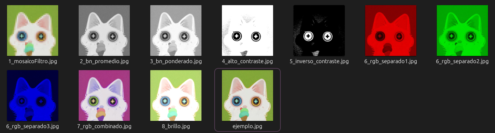
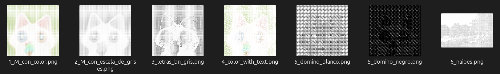
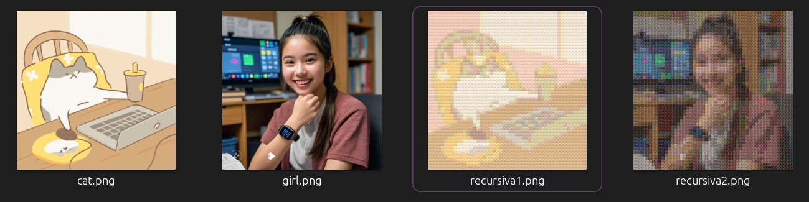
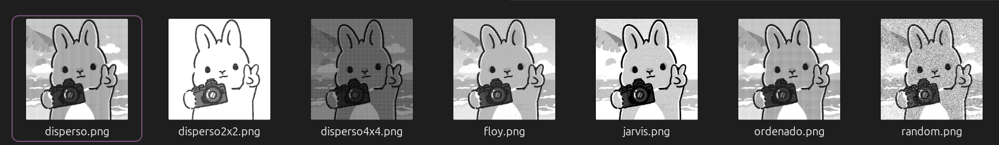
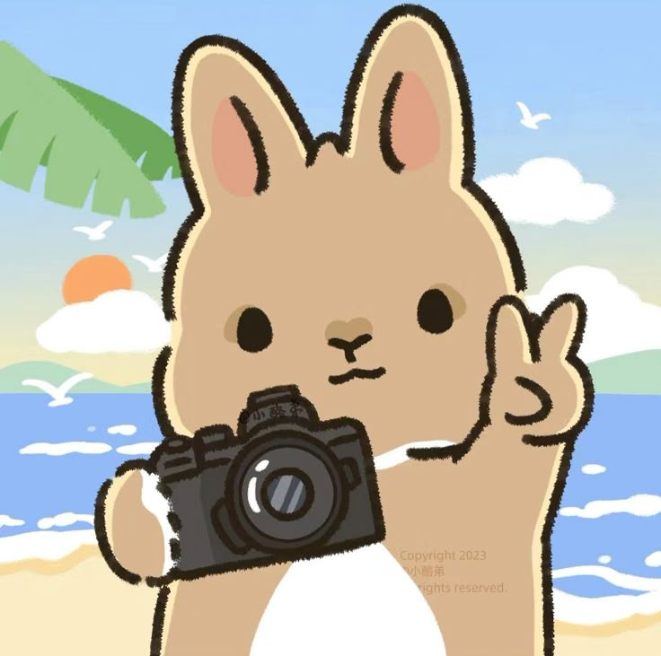
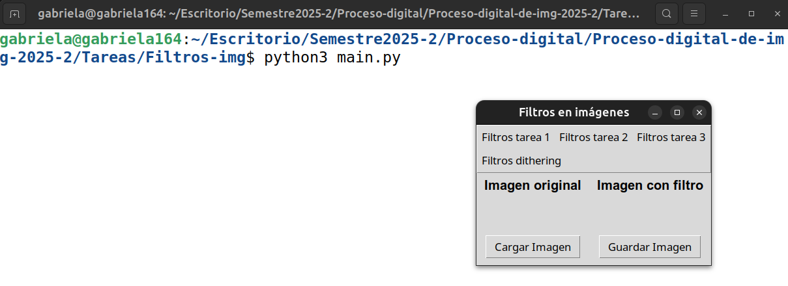
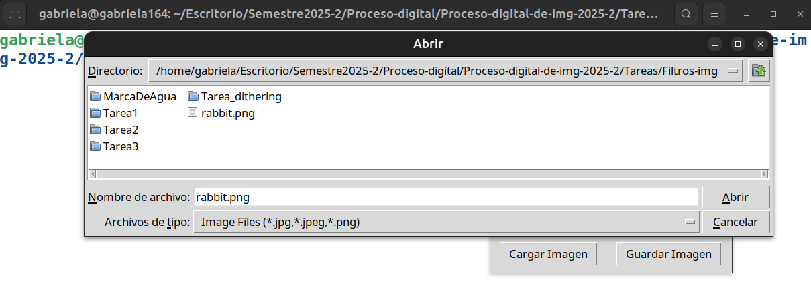
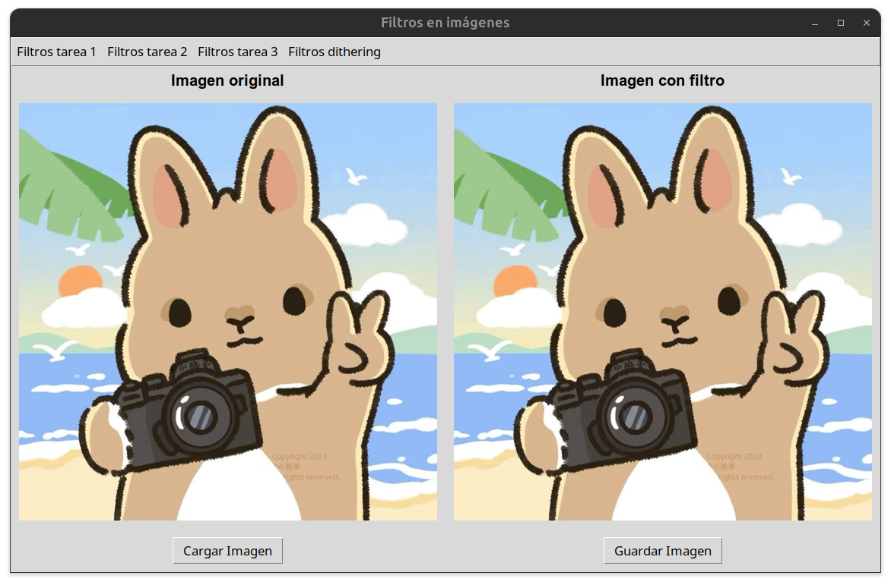
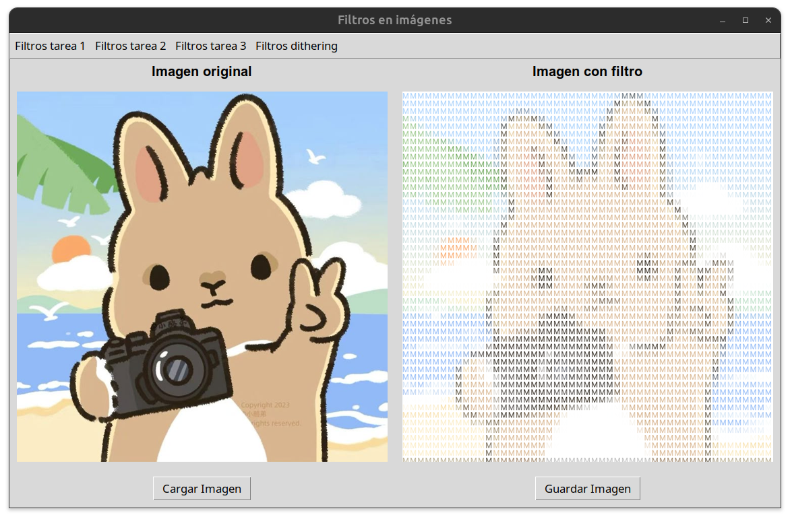

# 🖼️ 🌱 Procesador y aplicador de filtros de imagenes

**DESCRIPCIÓN**

Este proyecto es un procesador de imágenes que permite aplicar diversos filtros en tiempo real y visualizar los resultados a través de una interfaz gráfica interactiva. Además, proporciona funcionalidades avanzadas como la generación de imágenes recursivas, marcas de agua y procesamiento de imágenes con técnicas de dithering.






<br>


## 📚 Objetivo 

Aplicar conceptos de procesamiento de imágenes y recursividad para transformar imágenes mediante distintos filtros, incluyendo mosaico, escala de grises, alto contraste, dithering y más. También se busca explorar la generación de imágenes compuestas por miniaturas que mantienen la fidelidad cromática de la imagen original.


## Dependencias

Instalar las siguiente dependencias para que se ejecute de forma correcta el proyecto. 
  ``` bash 
    pip install pillow
  ```

  ``` bash 
    pip install numpy
  ```
  
## ⭐ Estructura del trabajo

Se tiene una carpeta llamada **Tareas** que contiene las siguientes carpetas

1. `Tarea1` : Contiene el script `Tarea1PD.py` que aplica los filtros:  mosaico, escala de grises (Promedio RGB), escala de grises (Ponderado (.30*r + .70*g + .10*b)), alto contraste, inverso contraste, RGB por separado, RGB combinado, brillo
2.  `Tarea2`: Contiene el script `Tarea2PD`y una carpeta _Fuentes_ con las fuentes: roboto, domino negro, domino blanco y cartas de tipo `.ttf`. Este script aplica los filtros sopa de letras. 
3.  `Tarea3`: Contiene el script `Tarea_img_recursivas` junto con otra carpeta _CSV_ necesario para que el script aplique el filtro de imagenes recursivas. Esta configurado para aplicar la misma imagén de relleno. 
4.  `Tarea_dithering.py`: Contiene el script `tarea_dithering` que aplica una lista de filtros dithering: azar, ordenado, disperso, disperso 2x2, disperso 4x4, Floyd steinberg y jarvis judice ninken. 
5.  `MarcaDeAgua`: Contiene un script `Tarea_marca_de_agua.py` y la imagen `logo_prueba.py`  que acturá como marca de agua sobre las imagenes originales. Y una carpeta con _img_reto_ma_ que contiene las imagenes del reto sin la marca de agua. 
7.  (**NUEVO**) `Tarea_semitonos_dados` contiene `semitonos_dados.py` que realiza los filtros de semitonos y dados. 


Junto a la carpeta **Tareas** se tiene 
- `img-readme`: Imagenes utilizadas dentro del readme. 
- `README.md`: readme para las instrucciones de ejecución y dependencias necesarias.  
- `main.py`: Archivo .py principal que nos ayuda a mostrar al usuario una interfaz de usuario y le permita aplicar aplicar el filtro que desee y pueda visualizarlo en tiempo real.  De igual manera, permite descargar la imagen con el filtro aplicado. 

## 📌 Explicación de ejecución

Ejecutar el script .py en VSC (o nuestro IDE preferido) o bien, escribir el siguiente **comando en terminal** en la ruta donde se encuentre el mismo archivo **main.py**

Linux:

``` bash
python3 main.py
```

En windows:

``` bash
python main.py
```
Podemos utilizar la imagen **rabbit.png** que se encuentra en el mismo directorio o escoger alguna otra imagen.




## 📚 Ejemplo de ejecución

<p>
    
    
</p>

<p>
    
    
</p>


## ✅ Encargados de impartir el curso

* 👨🏻‍🏫**Profesor** : Manuel Cristóbal López Michelone
* 👨🏻‍💻**Ayudante de laboratorio** : César Hernández Solís
* 👩🏻**Ayudante de teoría** : Yessica Martínez Reyes


## Alumna y No. de cuenta

* ✨👩🏻 Gabriela López Diego 318243485
* Fecha: Marzo 2025
