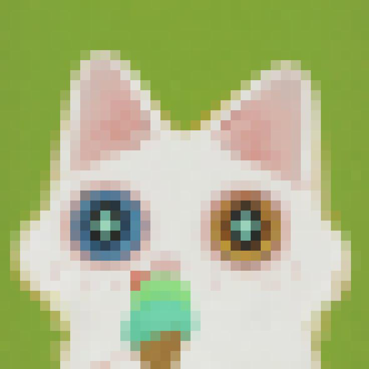
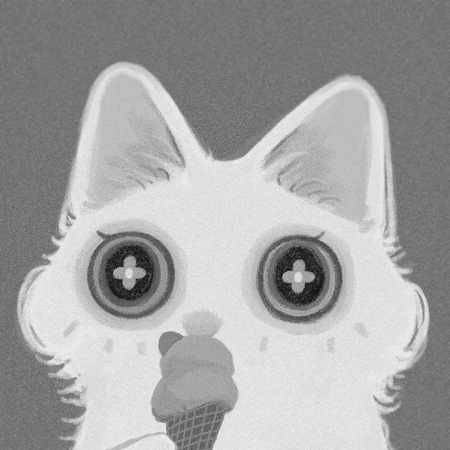
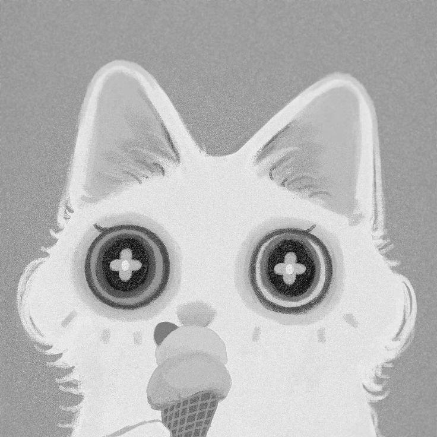
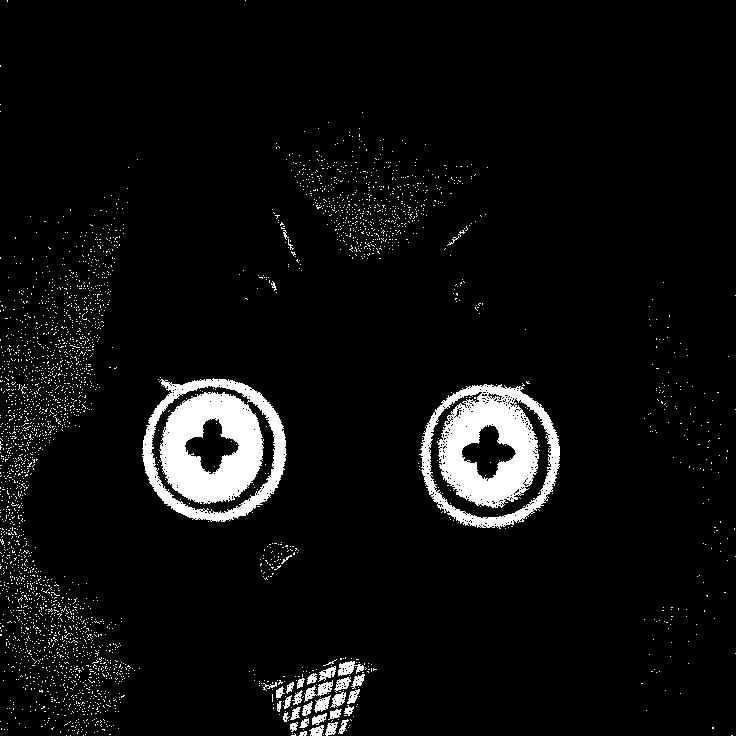
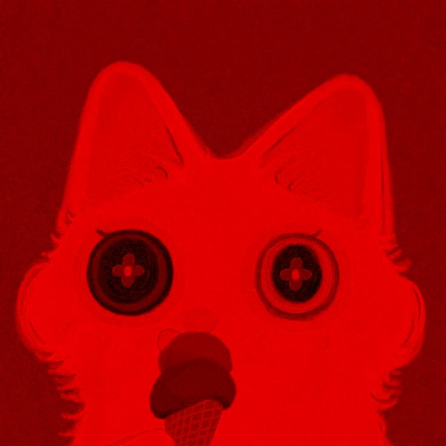
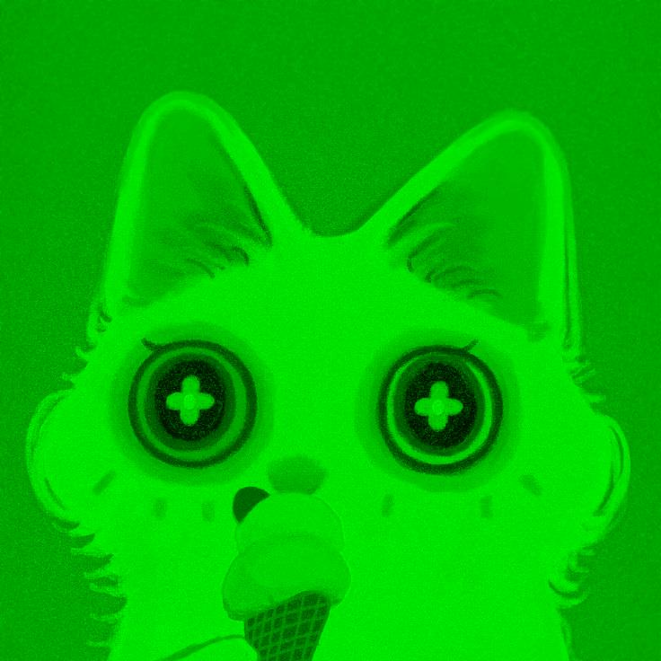
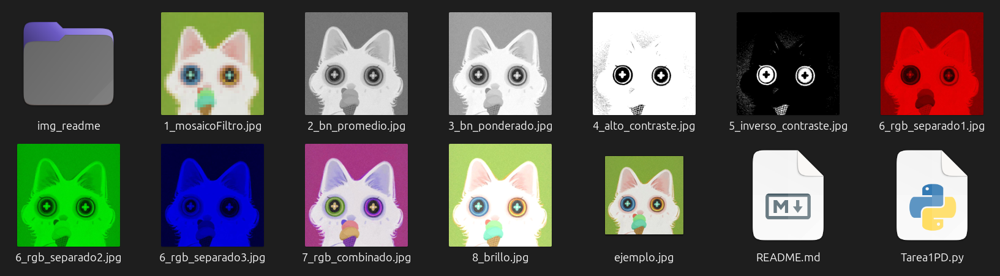

# 📷 🌱 Tarea 1: Filtros sencillos a una imagen

<!-- Muestra tres imágenes en un mismo renglón -->
<p>
  
  
  
    
  
</p>

<p>

  
  
  
  
  
</p>

<p>
<h4>Imagen original</h4>

</p>


## 📚 Objetivo 

Aplicar filtros sencillos a una imagen dada por el usuario. Nuestro script ejecuta los siguientes filtros. 

* Filtro mosaico
* Filtro blanco y negro (Promedio RGB)
* Filtro blanco y negro (Ponderado 0.2R, 0.7G, 0.1G)
* Filtro alto contraste 
* Filtro inverso contraste 
* Filtro mica RGB por separado 
* Filtro mica RGB combinado
* Filtro brillo

---

## 📌 Explicación de ejecución

Ejecutar el script .py en VSC (o nuestro IDE preferido) o escribir el siguiente **comando en terminal**.

Linux:

``` bash
python3 Tarea1PD.py
```

En windows:

``` bash
python Tarea1PD.py
```

Luego, otorgamos el nombre del archivo o ruta donde se encuentre la imagen a la que deseeamos aplicar los filtros (incluyendo la extención png o jpg). En nuestro caso, escribiremos: 

``` bash
ejemplo.jpg
```
Al finalizar, el script colocará en la misma carpeta las imagenes resultantes de aplicar cada uno de los filtros. 




## ✅ Encargados de impartir el curso

* 👨🏻‍🏫**Profesor** : Manuel Cristóbal López Michelone
* 👨🏻‍💻**Ayudante de laboratorio** : César Hernández Solís
* 👩🏻**Ayudante de teoría** : Yessica Martínez Reyes


## Alumna y No. de cuenta

* ✨👩🏻 Gabriela López Diego 318243485