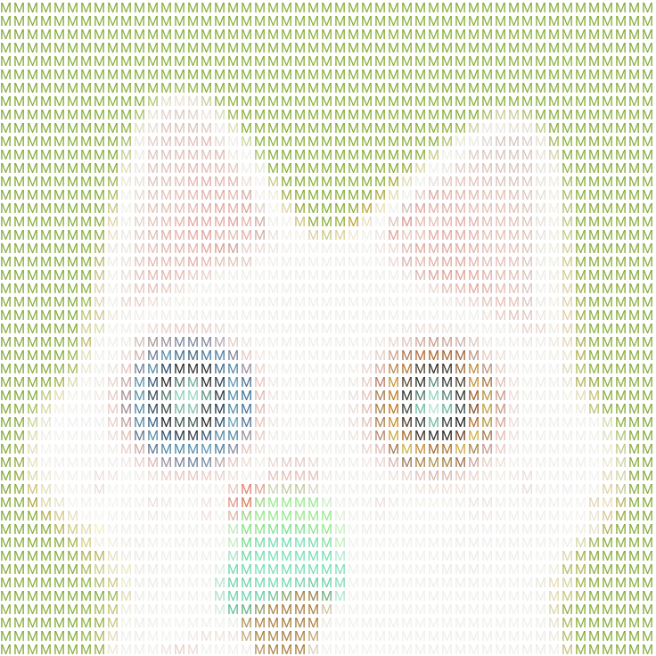
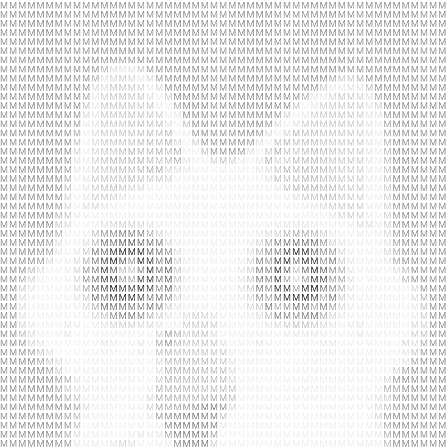
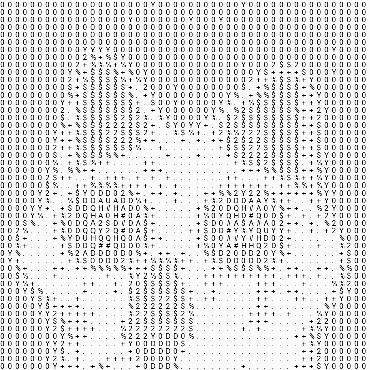
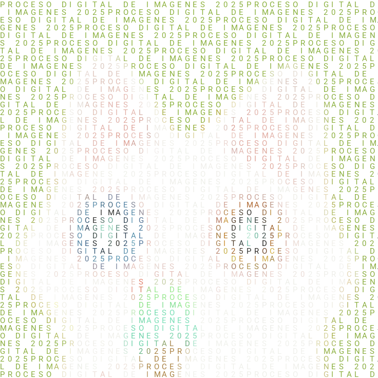
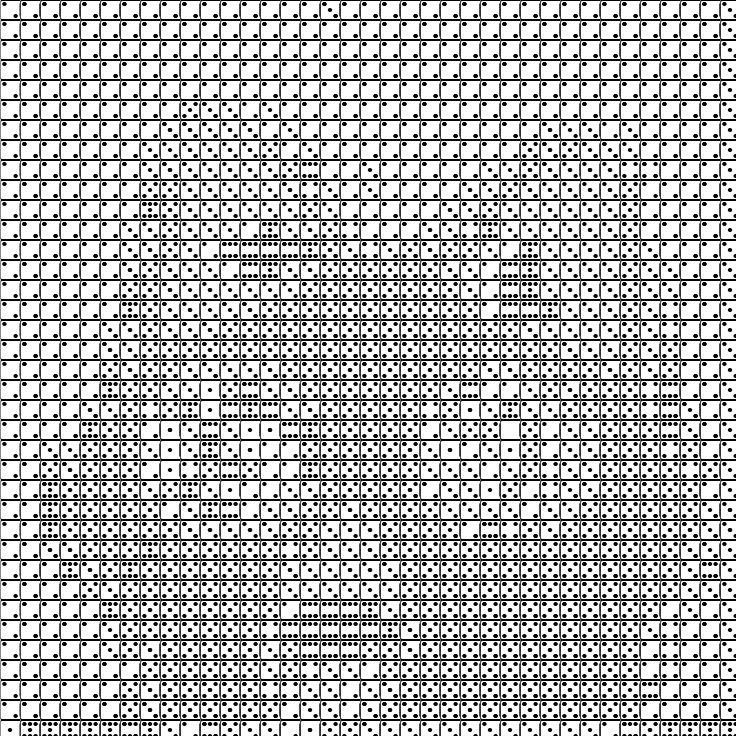
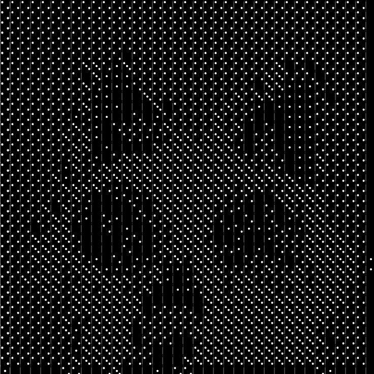
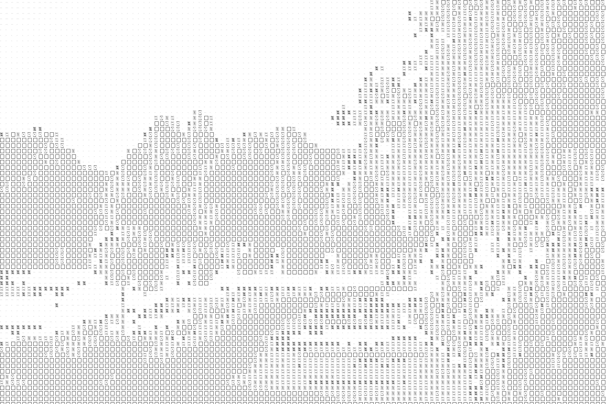
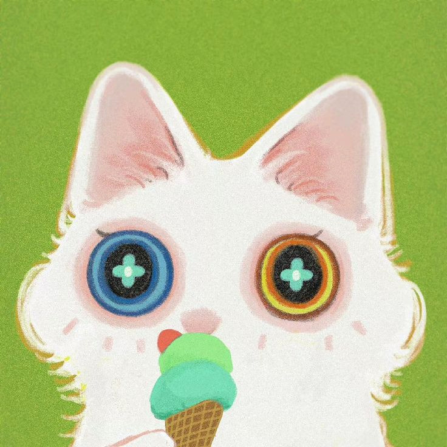
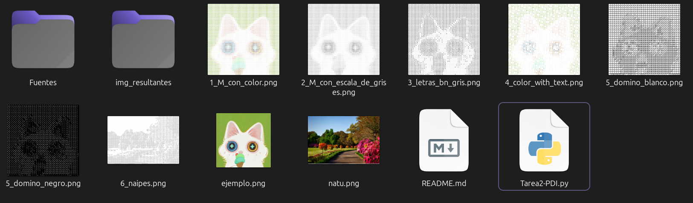

# 📷 🌱 Tarea 2: Filtros a una imagen SOPA DE LETRAS

<!-- Muestra tres imágenes en un mismo renglón -->
<p>
  
  
  
    
</p>

<p>
  
  
  
</p>

<p>
<h4>Imágenes originales</h4>


</p>


## 📚 Objetivo 

 El objetivo de esta tarea es procesar imágenes dividiéndolas en bloques y reemplazar cada bloque con caracteres o símbolos que representen la información visual de la imagen original. Se exploran diferentes técnicas, como el uso de colores promedio, escala de grises y caracteres de distintos niveles de contraste, para generar efectos similares a arte ASCII o representaciones estilizadas de la imagen.

---

### Nota

Para el último filtro _naipes_ se decidió mejor utilizar otra imagen para apreciar mejor el resultado generado. 

## 📌 Explicación de ejecución

Ejecutar el script .py en VSC (o nuestro IDE preferido) o bien, escribir el siguiente **comando en terminal** en la ruta de origen. 

Linux:

``` bash
python3 Tarea2-PDI.py
```

En windows:

``` bash
python Tarea2-PDI.py
```

Al finalizar, el script colocará en la misma carpeta las imagenes resultantes de aplicar cada uno de los filtros. 




## ✅ Encargados de impartir el curso

* 👨🏻‍🏫**Profesor** : Manuel Cristóbal López Michelone
* 👨🏻‍💻**Ayudante de laboratorio** : César Hernández Solís
* 👩🏻**Ayudante de teoría** : Yessica Martínez Reyes


## Alumna y No. de cuenta

* ✨👩🏻 Gabriela López Diego 318243485