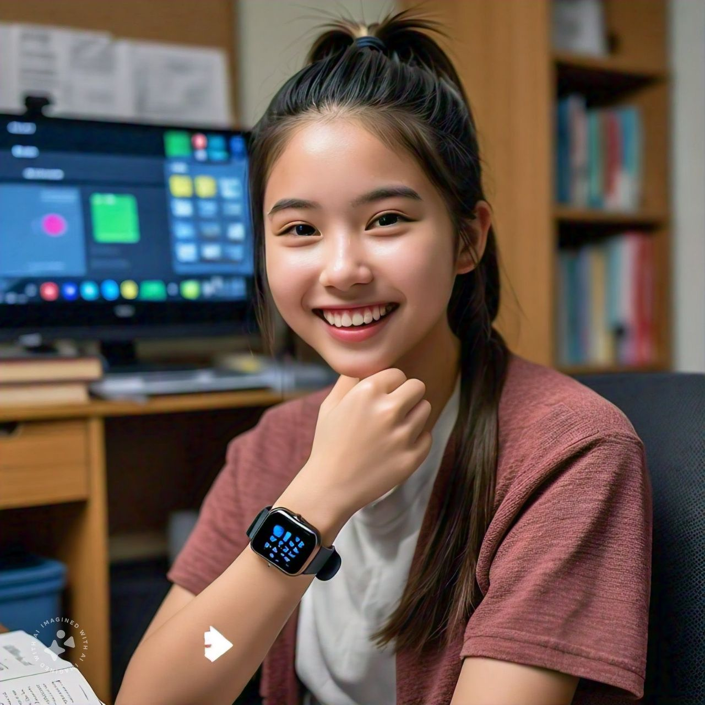
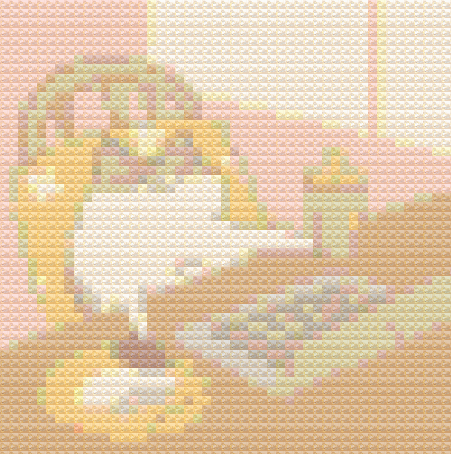
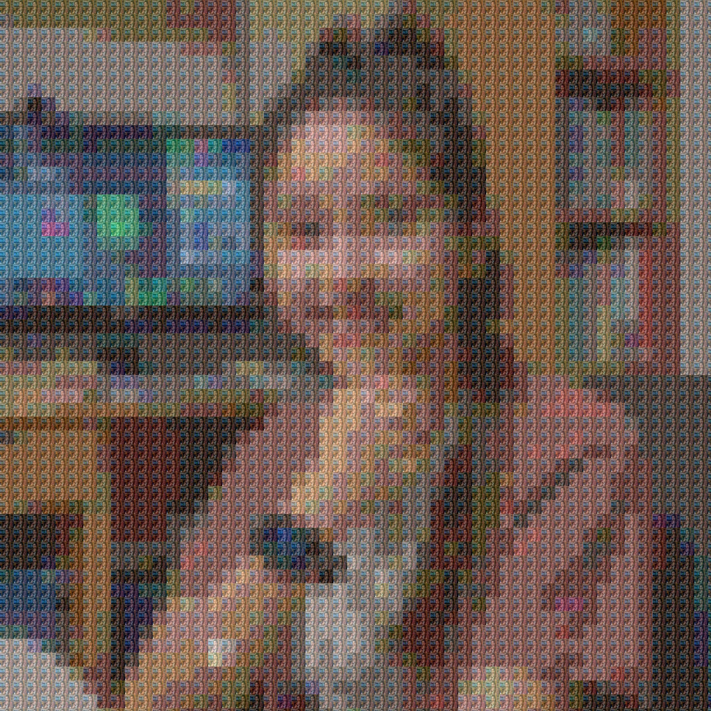
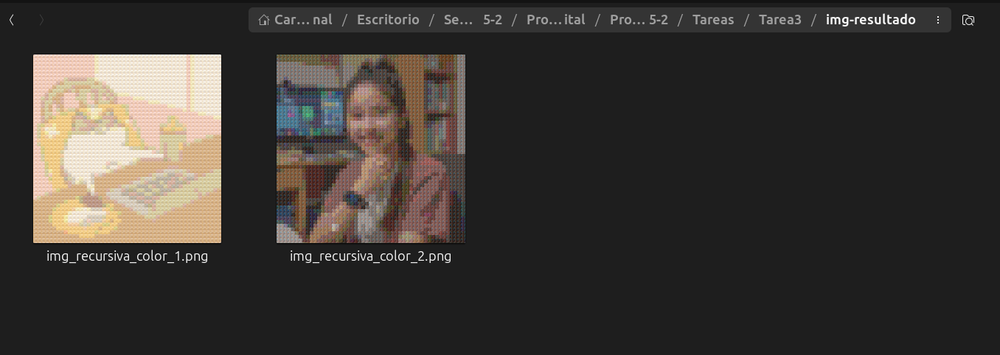

# 🖼️ 🌱 TAREA 03: IMÁGENES RECURSIVAS

**DESCRIPCIÓN**

En esta tarea generamos una imagen de forma recrusiva a partir de una imagen de relleno y otra de referencia. 


<!-- Muestra tres imágenes en un mismo renglón -->

<p>
<h4>Imágenes originales</h4>


</p>

<p>
<h4>Imágenes recursivas</h4>


</p>


## 📚 Objetivo 

Aplicar conceptos de procesamiento de imágenes y recursividad para crear una imagen formada por pequeñas miniaturas que se asemejan a los colores de la imagen de referencia. 


## Dependencias

Instalar la siguiente dependencia para que se ejecute de forma correcta el script. 
  ``` bash 
    pip install pillow
  ```
  
## Estructura de la tarea 

1. Carpeta`img` : contiene las imágenes para el readme. 
2. Carpeta `img-a-procesar`: contiene las imágenes originales antes de que sean utilizadas por el script. 
3. Carpeta `img-resultado`: contiene las imágenes recursivas construidas a partir del script. 
4. Carpeta `CSV`: contiene el archivo con la paleta de colores. 
5. Archivo `.py`: Script principal que genera las imágenes recursivas. 
6. README.md: readme para las instrucciones. 

## 📌 Explicación de ejecución

Ejecutar el script .py en VSC (o nuestro IDE preferido) o bien, escribir el siguiente **comando en terminal** en la ruta donde se encuentre el mismo archivo **.py**

Linux:

``` bash
python3 Img_recursivas.py
```

En windows:

``` bash
python Img_recursivas.py
```

Al finalizar, el script colocará las imágenes resultantes dentro de  la carpeta ***img-resultado***




## ✅ Encargados de impartir el curso

* 👨🏻‍🏫**Profesor** : Manuel Cristóbal López Michelone
* 👨🏻‍💻**Ayudante de laboratorio** : César Hernández Solís
* 👩🏻**Ayudante de teoría** : Yessica Martínez Reyes


## Alumna y No. de cuenta

* ✨👩🏻 Gabriela López Diego 318243485