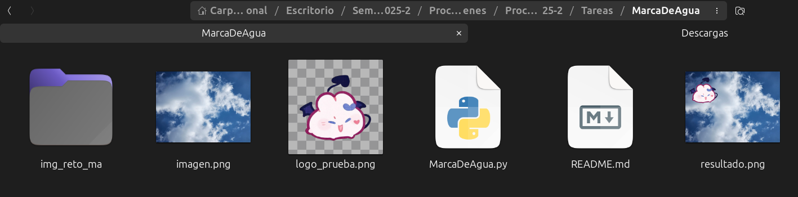

# 📷 🌱 Tarea Marca de agua

<!-- Muestra tres imágenes en un mismo renglón -->
<p>
  
  
  
</p>


## 📚 Objetivo 

Aplicar marca de agua a una imagen dada. 


## 📌 Explicación de ejecución

Ejecutar el script .py en VSC (o nuestro IDE preferido) o bien, escribir el siguiente **comando en terminal** en la ruta donde se encuentre el script ``.py``.

Linux:

``` bash
python3 MarcaDeAgua.py
```

En windows:

``` bash
python MarcaDeAgua.py
```

En el mismo script contiene las imagenes que utilizará. 
- **imagen.png**: Imagen a la cual le aplicará la marca de agua
- **logo_prueba.png**: Imagen que la colocará a la imagen original como marca de agua.

Al finalizar, el script colocará en la misma carpeta el resultado generado. 




## ✅ Encargados de impartir el curso

* 👨🏻‍🏫**Profesor** : Manuel Cristóbal López Michelone
* 👨🏻‍💻**Ayudante de laboratorio** : César Hernández Solís
* 👩🏻**Ayudante de teoría** : Yessica Martínez Reyes


## Alumna y No. de cuenta

* ✨ Nombre: Gabriela López Diego 
* ✨ No. de cuenta: 318243485
* ✨ Fecha: 26/Feb/25